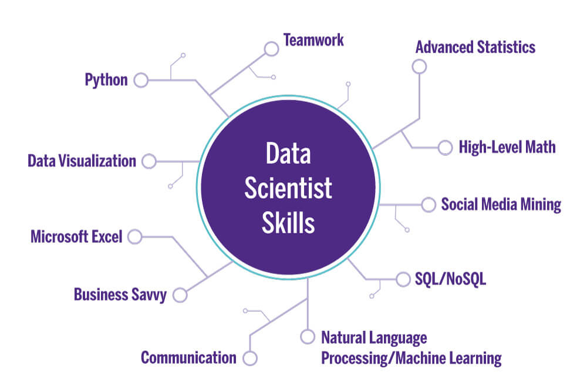

<!-- Heders #-->
# Markdown Cheat Sheet with Romario Coronel

Thanks for visiting [The Markdown Guide](https://www.markdownguide.org)


This Markdown Cheat Sheet provides a quick overview of all the syntax elements.
For get more information and reference about the basic syntax of markdown . Please visit the next links.

## Basic Syntax
For the  [Basic Syntax](https://www.markdownguide.org/basic-syntax)

## Extended Syntax
For the [Extended Syntax](https://www.markdownguide.org/extended-syntax)

## Basic Syntax

In the next section we will present a list of elements of the Markdown.

<!-- Heading -->

### 1. Heading 

# Heading
## Heading
### Heading
#### Heading
##### Heading
###### Heading

<!-- Bold **  (Negrita)-->
### 2. Bold  
This is an **Bold** Text

### 3. Italic
<!-- Italic * -->
This is an *italic* text
### 4. Strikethrough
<!-- Strikethrough ~~ (Tachado) -->
This is an ~~Strikethrough~~ Text

<!-- Unordered list (Listas no ordenada)  * -->
### 5. Unordered list

#### Fruit List
* First fruit  
  * Apple 
* Second Fruit
  * Orange
* Third Fruit
  * Banana
  
<!-- Ordered List (Listas ordenadas) -->

### 6. Ordered List
#### List of people of the my university

1. Julian 
   1. Carlos
2. Jhanmaicol
   1. Christhian
3.  Edison
4.  Patricio
5.  Ricardo
6.  Franklin

### 7. Code
`print("This is a result of")`

### 8. Horizontal Line
___
<!-- Links (Enlaces) -->
### 9. Link
#### Social Network of Romario Coronel

My reposity of GitHub [Personal Repository ](https://github.com/rcoroneldev "rcoroneldev")

My Linkedin [Personal Linkedin](https://www.linkedin.com/in/coroneldev/ "rcoroneldev")

My CV [Curriculum Vitae](https://resume.io/r/hsByEJvbw "Cv Romario Coronel")

My Web Site Personal [romariocoronel](https://rcoroneldev.github.io/romariocoronel/)


## Extended Syntax
These are elements additional of Markdown


### 10. Tables

<!-- Person Table -->
To continue we will present a table of people that have different kinds of personal informational.

|Id_Person    | FirstName | Lastname |PhoneNumber|
| ----------- | ----------- |----------- | ----------- |
|1    | Pedro | Rodriguez |936452148|
|2    | Juan | Maldonado |848514256|
|3    | Roberto | Dominguez |854745256|
|4    | Anthony | Calderon |936452854|
|5    | Pablo | Gutierrez |936452968|
|6    | jhainmacol | Ordoñez |854635152|

<!-- Course Table  -->
Then I will present a table that contains data of a course of the university

|Id_Course    | Name | TeacherName |RoomClass|
| ----------- | ----------- |----------- | ----------- |
|0001    | Machine Learning | Christhian |101|
|0002    | Deep Learning | Jhan |102|
|0003    | Data Mining | Luis |103|
|0004    | Data Gobernance |James |104|
|0005    | Data Visualization | Alejandro |105|
|0006    | Data Analytics | Fernando |106|

### 11. Code Block

<!-- Code -->
### Code of different programation languages
<!-- Python Code -->
#### Python Code

```python
a = 10
b = 20
def sum(a,b): 
  result1 = a + b
  return print("This is a result of code pyhton: " + result1)

```
#### Java Code
<!--  Java code -->
```java
int dato1 = 10;
int dato2 = 12;

public void suma(int dato1, int dato2){
  int result  = dato1 + dato2;
  system.out.print("This is a result of sum: " + result);
}

```

#### Json Code


```Json
{
  "FirstNmae":"Romario",
  "LastName":"Coronel",
  "emailAddress": "romario.coronel@outlook.com"
}

```
### 12. Task List

- [ ] Write the press release
- [X] Update the website
- [ ] Contact the media

### 13. Emoji

That is so funny! :joy: :muscle: :+1:

(See also [Copying and Pasting Emoji](https://www.markdownguide.org/extended-syntax/#copying-and-pasting-emoji))


<!-- Quote (Citas) -->
### 14. Quote

> This is a quote from coroneldev

<!-- Horizontal Line (Linea Horizontal) -->

<!-- Images -->

### 15. Image

<!-- This is a image of Linux Logo

 -->

This is a image of the skills of an Data Scientist




This is a image of the data science knowledge areas


<!-- Images Local -->
<!--  -->

<!-- [](https://www.youtube.com/watch?v=oxaH9CFpeEE) -->


 


